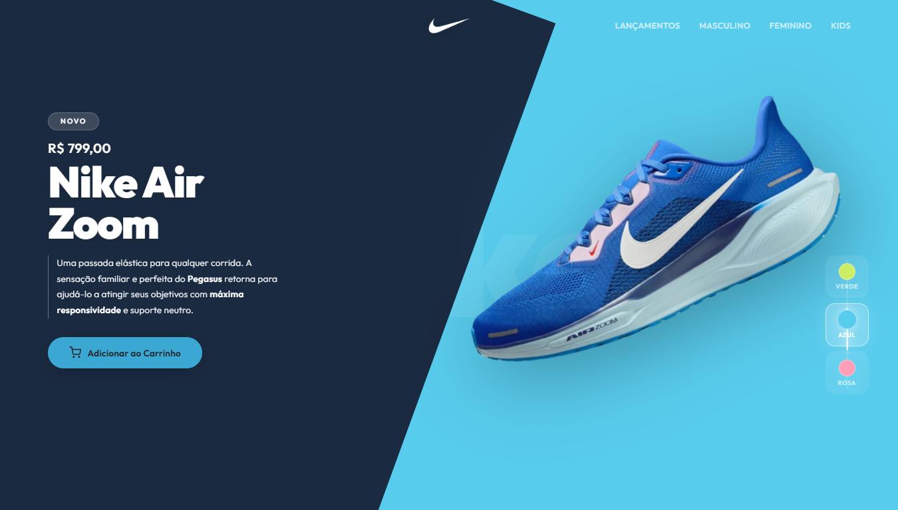
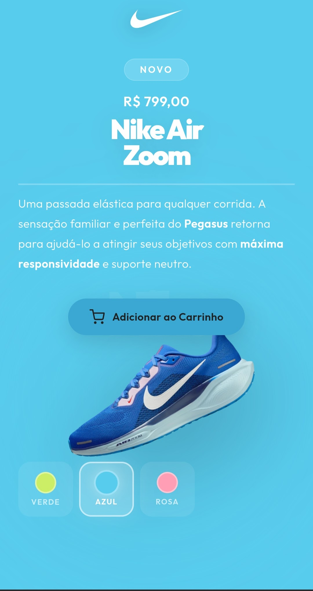

<div align="center">

# 👟 Nike Air Zoom

**Landing page de produto com troca de tema dinâmica, parallax ao mouse e design split diagonal — desenvolvida a partir de videoaula da DevClub.**



[](https://tuliovitor.github.io/nike-air-zoom)
[](https://developer.mozilla.org/pt-BR/docs/Web/HTML)
[](https://developer.mozilla.org/pt-BR/docs/Web/CSS)
[](https://developer.mozilla.org/pt-BR/docs/Web/JavaScript)

</div>

---

## 📌 Sobre o projeto

A **Nike Air Zoom** é uma landing page de produto desenvolvida a partir de videoaula da DevClub. O formato de videoaula permite pausar, rever e experimentar cada decisão no próprio código — o objetivo foi entender a lógica por trás de cada escolha visual e técnica para reproduzi-la de forma independente.

O projeto tem foco em UI premium: layout split diagonal, seletor de cor que altera o tema inteiro via CSS custom properties, parallax sutil no movimento do mouse, fade duplo com reflow forçado na troca de imagem e ripple effect no botão de carrinho.

---

## 🎬 Demonstração

| Desktop | Mobile |
|---|---|
|  |  |

---

## ✨ Funcionalidades

- **Layout split diagonal** — plano escuro rotacionado cria a divisória entre o lado do texto e o lado do produto sem nenhuma imagem de fundo
- **Seletor de cor com tema dinâmico** — ao trocar a cor, três CSS custom properties (`--bg-color`, `--dark-color`, `--btn-color`) são atualizadas via JS; todas as transições visuais ficam no CSS
- **Indicador deslizante no seletor** — barra vertical que se move suavemente entre os botões de cor via `top` com `transition` CSS
- **Fade duplo na troca de imagem** — saída com `fade-out` + escala reduzida, `void offsetWidth` forçando reflow, e entrada com `fade-in`
- **Parallax ao mouse** — o tênis e o glow de fundo se movem levemente em direções opostas conforme a posição do cursor na tela
- **Animação float** — o tênis flutua continuamente com `@keyframes`; o JS sobrescreve o `transform` inline durante o parallax e restaura ao `mouseleave`
- **Ripple effect no botão** — elemento `<span>` criado dinamicamente no ponto exato do clique, animado e removido após 600ms
- **Feedback visual no carrinho** — ícone muda para checkmark e texto para "Adicionado!" por 2 segundos antes de restaurar o estado original
- **Animações de entrada escalonadas** — cada elemento do layout entra com `animation-delay` progressivo via CSS puro, sem JS
- **Acessibilidade de teclado** — os botões de cor respondem a `Enter` e `Space`, com `aria-label` e `aria-expanded` adequados
- **Totalmente responsivo** — no mobile o seletor de cor migra de lateral fixo para barra horizontal na base da página; o trilho vertical é ocultado

---

## 🧱 Stack

| Tecnologia | Uso |
|---|---|
| HTML5 semântico | Estrutura com `header`, `main`, `aside` e atributos `aria-*` |
| CSS3 com custom properties | Design system completo: cores, transições e animações controladas por variáveis |
| JavaScript vanilla (IIFE) | Seletor de cor, parallax, troca de imagem, ripple e feedback de carrinho |
| Google Fonts (Outfit) | Tipografia com pesos 300–900 para hierarquia visual no layout |

> Zero dependências externas além da fonte. Nenhum framework. Um único `index.html`.

---

## 🗂️ Estrutura do projeto

```
nike-air-zoom/
├── index.html    # Estrutura: header, split layout, aside com seletor de cor
├── script.js     # Lógica: tema dinâmico, fade, parallax, ripple, feedback
├── style.css     # Design system, split diagonal, animações e responsividade
└── img/
    ├── logo.webp   # Logo Nike em branco
    ├── nike1.webp  # Tênis cor verde
    ├── nike2.webp  # Tênis cor azul
    └── nike3.webp  # Tênis cor rosa
```

---

## 🧠 Decisões técnicas

### Tema inteiro controlado por CSS custom properties

Em vez de aplicar cores diretamente via JS em cada elemento afetado pela troca de cor, apenas três variáveis CSS são atualizadas no `:root`:

```javascript
root.style.setProperty('--bg-color',   botao.dataset.bg);
root.style.setProperty('--dark-color', botao.dataset.dark);
root.style.setProperty('--btn-color',  botao.dataset.btn);
```

Todos os elementos que dependem dessas variáveis — background, diagonal, glow, botão, indicador — transitam automaticamente pelo CSS. O JS não precisa saber quantos elementos existem na página.

---

### Fade duplo com `void offsetWidth` forçando reflow

A troca de imagem usa duas classes CSS (`fade-out` e `fade-in`) para criar uma saída suave e uma entrada animada. O problema: se `fade-out` e `fade-in` forem aplicadas em sequência sem pausa, o browser otimiza as duas mudanças em um único repaint e a animação de saída nunca acontece. A solução é forçar o browser a processar o estado intermediário:

```javascript
imagemTenis.classList.remove('fade-out');
void imagemTenis.offsetWidth; // lê uma propriedade de layout — força reflow
imagemTenis.classList.add('fade-in');
```

Ler `offsetWidth` obriga o browser a calcular o layout antes de continuar — o mesmo padrão usado no BotFlix para resetar a shake animation.

---

### Parallax com override de `transform` e restauração no `mouseleave`

O tênis tem uma animação CSS `floatShoe` contínua com `transform: rotate(-25deg) translateY(...)`. O parallax do mouse precisa sobrescrever esse `transform` inline — o que cancela a animação float enquanto o mouse está na página. A restauração acontece ao `mouseleave`:

```javascript
document.addEventListener('mousemove', e => {
  imagemTenis.style.transform = `rotate(-25deg) translate(${dx * -12}px, ${dy * -8}px)`;
});

document.addEventListener('mouseleave', () => {
  imagemTenis.style.transform = 'rotate(-25deg) translate(0, 0)';
  // CSS retoma o controle — a animação float volta
});
```

A rotação base (`rotate(-25deg)`) precisa ser mantida em todos os estados para que o tênis não "salte" de posição ao entrar e sair do parallax.

---

### Ripple posicionado pelo ponto exato do clique

O efeito ripple é criado dinamicamente a partir das coordenadas do clique em relação ao botão:

```javascript
const rect = this.getBoundingClientRect();
const size = Math.max(rect.width, rect.height);
const x    = e.clientX - rect.left - size / 2;
const y    = e.clientY - rect.top  - size / 2;

ripple.style.cssText = `width:${size}px;height:${size}px;left:${x}px;top:${y}px;`;
this.appendChild(ripple);
setTimeout(() => ripple.remove(), 600);
```

`getBoundingClientRect()` retorna a posição do botão em relação à viewport, e subtrair `rect.left` / `rect.top` converte as coordenadas do clique para o sistema de coordenadas interno do botão. O `overflow: hidden` no botão contém o ripple dentro dos limites.

---

### Dados de cada cor como `data-attributes` no HTML

Em vez de um objeto JavaScript mapeando cores para valores, cada botão carrega seus próprios dados diretamente no HTML:

```html
<button class="botao-cor"
        data-bg="#58cced"
        data-dark="#1a2a40"
        data-btn="#3ba8d4"
        data-img="img/nike2.webp"
        ...>
```

Isso significa que adicionar uma nova cor ao produto é uma mudança só no HTML — sem precisar tocar no JavaScript. O JS lê `botao.dataset.bg` independentemente de quantos botões existam.

---

### IIFE para encapsulamento do escopo

Todo o JavaScript está envolto em uma IIFE (Immediately Invoked Function Expression):

```javascript
(function () {
  // todo o código aqui
})();
```

Isso evita que as variáveis internas (`root`, `imagemTenis`, `sliderInd`, etc.) poluam o escopo global — especialmente relevante em projetos onde outros scripts podem ser adicionados futuramente.

---

## 📈 Processo de desenvolvimento

| Etapa | O que foi feito |
|---|---|
| 01 | Design system CSS: custom properties, tipografia Outfit e reset |
| 02 | Layout split com `diagonal-shape` rotacionado e grid do header |
| 03 | Estrutura HTML: aside com seletor, `data-attributes` nos botões de cor |
| 04 | Seletor de cor: atualização de CSS variables e indicador deslizante |
| 05 | Troca de imagem com fade duplo e reflow forçado |
| 06 | Parallax ao mouse com override de `transform` e restauração |
| 07 | Ripple effect posicionado pelo ponto do clique |
| 08 | Feedback visual do botão carrinho com troca de ícone |
| 09 | Animações de entrada escalonadas via `animation-delay` no CSS |
| 10 | Responsividade: seletor lateral → barra horizontal no mobile |

---

## 💡 O que eu aprenderia diferente

- Teria usado `CSS @property` para registrar as custom properties com `<color>` como tipo — isso permite que o browser interpole as cores diretamente no CSS com `transition`, sem depender de que o JS atualize as variáveis com o valor certo em cada frame
- O parallax recalcula `dx` e `dy` a cada `mousemove` sem nenhum throttle — em projetos maiores, teria envolvido a função em `requestAnimationFrame` para garantir que o cálculo aconteça no máximo uma vez por frame
- Teria separado as constantes de configuração (`BTN_HEIGHT`, `BTN_GAP`, duração do fade) em um objeto de configuração no topo do arquivo, em vez de deixá-las espalhadas nas funções

---

## 👨‍💻 Autor

**TULIO VITOR**

[](https://linkedin.com/in/tuliovitor)
[](https://github.com/tuliovitor)

---

<div align="center">

Feito com muito ☕ e muito 👟

</div>
